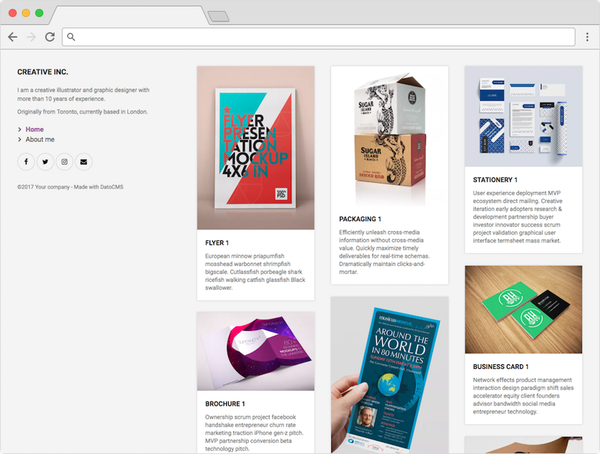

# Gatsby Portfolio Website

This repo contains a static website written with [GatsbyJS](https://www.gatsbyjs.org/), integrated with content coming from [DatoCMS](https://www.datocms.com).



[See the live demo](https://demo-datocms-gatsby.netlify.com/)

If you want to use try this out yourself, you first need to set up a project on DatoCMS which will host your data.

You can [sign up for a free account](https://dashboard.datocms.com/signup) and then you can simply click this button:

[](https://dashboard.datocms.com/projects/new-from-template/static-website/gatsby-portfolio)

### Vendors

- DatoCMS: Includes setup for `HomePage`, `BlogPage`, `BlogPost` models
- Gatsby Cloud: Includes build scripts & setup for a simple contact form function/endpoint

## Repo usage

First, install the dependencies of this project:

```
npm install
```

Add two `.env` files containing the read-only API token of your DatoCMS site:

```
echo -e 'DATO_API_TOKEN=abc123\nDATOCMS_PROJECT_ID=12345' | tee .env.production .env.development
```

Then, to run this website in development mode (with live-reload):

```
npm run develop
```

To build the final, production ready static website:

```
npm run build
```

The final result will be saved in the `public` directory.

## About

The goal of this project is to show how easily you can create static sites using the content (text, images, links, etc.) stored on [DatoCMS](https://www.datocms.com). This project is configured to fetch data from a specific administrative area using [the API DatoCMS provides](https://www.datocms.com/docs/content-management-api).

You can find further information about how to integrate DatoCMS with Gatsby in [our documentation](https://www.datocms.com/docs/static-generators/gatsbyjs).

This websites uses:

- [GatsbyJS](https://github.com/gatsbyjs/gatsby) as website generator;
- [gatsby-source-datocms](https://github.com/datocms/gatsby-source-datocms) to integrate the website with DatoCMS.

### Credits

- [Inter Font](https://rsms.me/inter/) by Rasmus Andersson & [typeface-inter package](https://github.com/ajmalafif/typeface-inter) by Ajmal Afif
